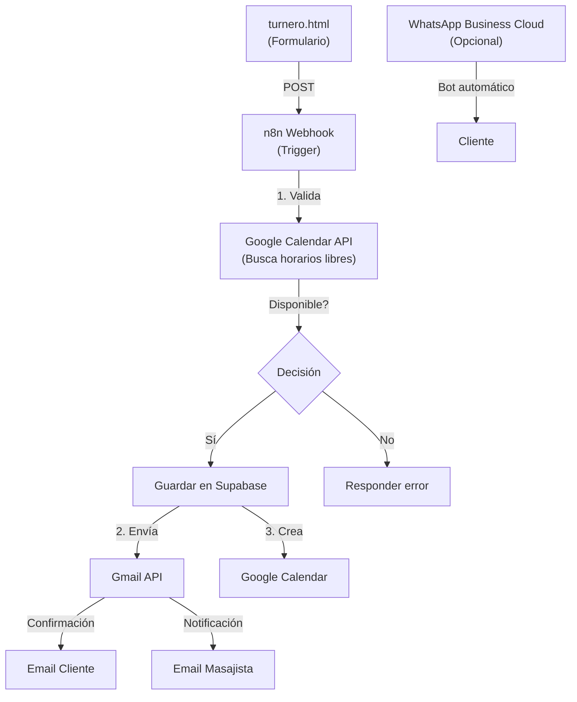

# Plan de Automatización: Bell Studio (Masajes)
**Sistema de Agenda de Turnos + Notificaciones + WhatsApp Bot**

---

## 📋 RESUMEN EJECUTIVO

Implementar un sistema completamente automatizado y **100% gratis** que reemplace la agenda manual de turnos con:
- Reserva de turnos vía formulario web
- Validación automática de disponibilidad (Google Calendar)
- Envío de emails (Gmail)
- Mensajería automática vía WhatsApp Business Cloud
- Todo sin máquina local, todo en la nube

**Presupuesto total: $0**

---

## 🔧 TECNOLOGÍAS A USAR

| Componente | Tecnología | Costo | Rol |
|-----------|-----------|--------|-----|
| **Plataforma principal** | n8n Cloud | $0 (Plan Free) | Orquestador de flujos |
| **Base de datos** | Supabase | $0 (Plan Free) | Almacenamiento de reservas |
| **Calendario** | Google Calendar | $0 | Validar disponibilidad |
| **Email** | Gmail | $0 | Enviar notificaciones |
| **Chat** | WhatsApp Business Cloud | Variable | Bot de mensajería |
| **Hosting web** | GitHub Pages | $0 | Página con formulario |
| **Versionado** | GitHub | $0 | Control de cambios |

**Total: $0 mensuales (con opción de pagar WhatsApp después si lo deseas)**

---

## 📊 SITUACIÓN ACTUAL

### Estado actual (Bell Studio - Masajes)
- Página estática en `https://github.com/marcelete/msj.github.io` (HTML puro)
- Archivo `turnero.html` para reservar turnos
- **Problema**: Actualmente no hay backend funcionando
- **Sistema manual**: Turnos gestionados fuera de la plataforma
- No hay confirmación automática de reservas
- No hay recordatorios
- No hay integración con calendario

### Objetivo: Estado deseado

```
Cliente visita web → Rellena formulario → Validación disponibilidad 
→ Confirmación automática email → Recordatorio 24h antes 
→ Notificación a masajista vía WhatsApp/Email
→ Turno en Google Calendar
```

---

## 🎯 QUÉ QUEREMOS LOGRAR

### 1. **Sistema de Reservas**
- Cliente accede a `turnero.html`
- Selecciona fecha y horario
- n8n valida automáticamente si está libre en Google Calendar
- Muestra solo horarios disponibles
- Envía confirmación por email al cliente

### 2. **Notificaciones por Email**
- **Confirmación**: "Tu reserva está confirmada para el 28/05 a las 15:00"
- **Recordatorio**: 24 horas antes: "Te recordamos tu turno mañana"
- **A la masajista**: "Nueva reserva - Juan García - 28/05 15:00"

### 3. **Integración Google Calendar**
- Cada reserva crea un evento automático
- Evita doble-booking
- Sincroniza con disponibilidad compartida

### 4. **WhatsApp Bot (Bonus)**
- Cliente envía: "Quiero reservar un turno"
- Bot responde: "¡Hola! ¿Qué día prefieres?"
- Conversación asistida hasta confirmar
- Envía confirmación por WhatsApp

---

## 🏗️ ARQUITECTURA DE IMPLEMENTACIÓN



---

## 📄 PÁGINA A MODIFICAR: `turnero.html`

### Estado actual
```html
<!-- Formulario básico, sin procesamiento backend -->
<form id="booking-form">
  <input type="text" name="name" placeholder="Nombre">
  <input type="email" name="email" placeholder="Email">
  <input type="date" name="date">
  <input type="time" name="time">
  <button type="submit">Reservar</button>
</form>
```

### Cambios necesarios

**1. Agregar JavaScript que hable con n8n:**
```javascript
document.getElementById('booking-form').addEventListener('submit', async (e) => {
  e.preventDefault();
  
  const data = {
    name: document.querySelector('[name="name"]').value,
    email: document.querySelector('[name="email"]').value,
    date: document.querySelector('[name="date"]').value,
    time: document.querySelector('[name="time"]').value,
    service: 'masaje'
  };
  
  // Llamar webhook de n8n
  const response = await fetch('https://n8n.your-instance.com/webhook/booking', {
    method: 'POST',
    headers: { 'Content-Type': 'application/json' },
    body: JSON.stringify(data)
  });
  
  const result = await response.json();
  if (result.success) {
    alert('¡Reserva confirmada! Revisa tu email.');
  } else {
    alert(`No disponible: ${result.message}`);
  }
});
```

**2. Dinámicas de horarios (opcional pero mejor UX):**
- Usar `<select>` poblado dinámicamente con horarios libres
- JavaScript consulta n8n antes de renderizar opciones
- Evita que usuario vea horarios no disponibles

---

## 🔄 FLUJOS DE n8n A CREAR

### Flujo #1: "Booking - Recibir Reserva"
1. **Trigger**: HTTP Webhook (recibe POST del formulario)
2. **Validar**: Google Calendar - buscar eventos en fecha/hora
3. **Condicional**: ¿Está disponible?
   - **Sí**: Continuar
   - **No**: Responder "No disponible"
4. **Guardar**: Insertar en Supabase (tabla: `reservas`)
5. **Email confirmación**: Enviar a cliente (Gmail)
6. **Email notificación**: Enviar a masajista (Gmail)
7. **Calendar**: Crear evento en Google Calendar
8. **Responder**: HTTP Response con éxito

### Flujo #2: "Recordatorio - 24h Antes" (Opcional)
1. **Trigger**: Horario programado (cron: diariamente a las 9am)
2. **Query**: Supabase - buscar reservas para mañana
3. **For each**: Enviar email a cada cliente
4. **Email**: "Te recordamos tu turno mañana a las 15:00"

### Flujo #3: "WhatsApp Bot" (Opcional pero recomendado)
1. **Trigger**: Mensaje WhatsApp recibido
2. **AI Node** (Claude via API): Procesar intención
3. **Condicional**: ¿Es una solicitud de reserva?
4. **Flujo interactivo**: 
   - Bot: "¿Qué día prefieres?"
   - Cliente responde
   - Bot: "¿A qué hora?"
   - Cliente responde
   - Confirma y ejecuta Flujo #1
5. **Enviar confirmación**: WhatsApp al cliente

---

## 💾 ESTRUCTURA SUPABASE

### Tabla: `reservas`
```
id (uuid, PK)
nombre (text)
email (text)
telefono (text)
fecha_reserva (date)
hora_reserva (time)
servicio (text) → "masaje terapéutico", "relajación", etc.
estado (text) → "confirmada", "cancelada", "completada"
created_at (timestamp)
google_calendar_event_id (text)
```

### Tabla: `servicios` (Catálogo)
```
id (uuid)
nombre (text)
duracion_minutos (integer)
precio (decimal)
```

---

## 🛠️ SKILLS DISPONIBLES

### Skills que TENEMOS ✅
- `czlonkowki/n8n-mcp` - Para interactuar con n8n desde Claude Code
- `product-self-knowledge` - Para consultar sobre Claude Code y APIs
- `frontend-design` - Para mejorar UI si lo requieren

### Skills que NECESITAMOS
- **Ninguna nueva necesaria** - La implementación no requiere skills especiales
- Usaremos Claude Code para debuggear si es necesario
- Frontend ya está en HTML/CSS (no necesita skill adicional)

---

## 🚀 ROADMAP DE IMPLEMENTACIÓN

### **Fase 1: Setup (30 min)**
- [ ] Crear cuenta n8n Cloud (si aún no tienes)
- [ ] Conectar Google Account a n8n (Gmail + Google Calendar)
- [ ] Crear tabla en Supabase
- [ ] Generar credenciales API

### **Fase 2: Flujo Principal (2-3 horas)**
- [ ] Crear Flujo #1 en n8n (Booking webhook)
- [ ] Probar con curl/Postman
- [ ] Ajustar validaciones

### **Fase 3: Frontend (1 hora)**
- [ ] Modificar `turnero.html` con código JavaScript
- [ ] Agregar validación de horarios
- [ ] Hacer commit a GitHub

### **Fase 4: Refinamiento (1 hora)**
- [ ] Probar flujo end-to-end
- [ ] Ajustar mensajes de email
- [ ] Documentar para referencia futura

### **Fase 5: WhatsApp (Opcional, +1-2 horas)**
- [ ] Configurar Meta Developer Account
- [ ] Integrar WhatsApp Cloud API a n8n
- [ ] Crear Flujo #3

### **Fase 6: Recordatorios (Opcional, +30 min)**
- [ ] Crear Flujo #2 (horario programado)

**Tiempo total estimado: 4-7 horas** (sin WhatsApp: 3-4 horas)

---

## 🔐 SEGURIDAD Y DATOS

### Credenciales a guardar (NO en GitHub)
- ✅ n8n guarda automáticamente
- ✅ Supabase (credenciales secretas)
- ✅ Google OAuth tokens
- ⚠️ Nunca commitear API keys

### HTTPS
- ✅ GitHub Pages: HTTPS automático
- ✅ n8n Cloud: HTTPS automático
- ✅ Supabase: HTTPS automático

---

## 📱 FLUJOS ESPECÍFICOS DE USUARIO

### **Cliente: Reservar turno vía web**
1. Accede a `msj.github.io/turnero.html`
2. Rellena nombre, email, selecciona fecha/hora
3. Click "Reservar"
4. JavaScript valida con n8n
5. Recibe confirmación por email
6. ¡Turno confirmado!

### **Cliente: Recibe recordatorio**
1. 24h antes: Email automático "Te recordamos tu turno"
2. 1h antes (opcional): Notificación WhatsApp

### **Masajista: Gestión**
1. Abre Google Calendar → ve turno creado automáticamente
2. Recibe email: "Nueva reserva - Juan García - 15:00"
3. Responde por email o WhatsApp si necesita cambios
4. Cliente cancela por email/WhatsApp → marca como cancelada en Supabase

### **Cliente: Cancelar reserva**
1. Envía email o WhatsApp: "Quiero cancelar mi reserva"
2. n8n procesa (flujo adicional opcional)
3. Supabase actualiza estado a "cancelada"
4. Evento se elimina de Google Calendar

---

## 🔗 REFERENCIAS Y DOCUMENTOS

### Configuración requerida
- n8n Docs: https://docs.n8n.io/
- Google Calendar API: https://developers.google.com/calendar
- Gmail API: https://developers.google.com/gmail/api
- Supabase Docs: https://supabase.com/docs
- WhatsApp Cloud API: https://developers.facebook.com/docs/whatsapp/cloud-api

### Workflow templates útiles en n8n
- WhatsApp appointment scheduling: https://n8n.io/workflows/5855
- Gmail + Google Calendar: https://n8n.io/workflows/

---

## ✅ CHECKLIST FINAL

### Antes de empezar
- [ ] Tengo cuenta n8n Cloud
- [ ] Tengo Google Account (Gmail + Google Calendar)
- [ ] Tengo Supabase account
- [ ] Repositorio GitHub para msj.github.io

### Durante la implementación
- [ ] Flujo #1 funciona end-to-end
- [ ] Emails se envían correctamente
- [ ] Google Calendar se sincroniza
- [ ] Horarios validados correctamente
- [ ] turnero.html modificado

### Después de lanzar
- [ ] Testear con reserva real
- [ ] Validar que emails llegan
- [ ] Revisar que no hay doble-booking
- [ ] Documentar cambios en GitHub

---

## 🎓 PRÓXIMOS PASOS (Orden recomendado)

1. **Ahora**: Validar que este plan es correcto con Chelo
2. **Luego**: Crear credenciales en n8n
3. **Después**: Construir Flujo #1 paso a paso
4. **Siguiente**: Probar y ajustar
5. **Finalmente**: Agregar WhatsApp si se desea

---

**Documento actualizado: 26-05-2026**
**Estado: Listo para validación**
